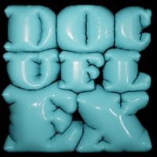

# DocuFlex: A Domain Specific Language for Dynamic Documentation



## Introduction

DocuFlex is a domain-specific language designed to facilitate the dynamic and automated generation of software documentation. It leverages concepts such as classes, inheritance, and polymorphism to allow for the creation of accurate, comprehensive, and customizable documents. DocuFlex is designed to be simple yet powerful, offering a high degree of flexibility in defining and generating documentation.

## Basic Concepts

### Documents and Blocks

In DocuFlex, a document represents a complete piece of documentation, such as a tutorial, API reference, or user manual. Each document consists of various sections, or blocks, which can include an introduction, content, conclusion, and metadata.

Blocks are defined as either primitive or extended from existing blocks, allowing for a high degree of customizability. Primitive blocks are the most basic types, while extended blocks inherit attributes and functionality from their parent blocks.

### Classes and Inheritance

DocuFlex employs object-oriented principles. Documents and blocks are defined as classes, with the option to extend other classes using the `extends` keyword. This enables a form of inheritance, where child classes can inherit properties and methods from parent classes.

### Metadata

Every document includes a block of metadata that contains information about the document, such as the author, revision version, and revision date. The contents of the metadata block can be automatically populated using built-in functions and variables.

## Key Features

### Variables and Functions

DocuFlex supports the use of variables and built-in functions. Variables are defined using the `@` symbol and can be used to store and reference data within and between documents. Built-in functions, such as `peekAt`, `extract`, `readFile`, and `formatDate`, can perform various tasks, including extracting and manipulating data, reading file contents, and formatting dates.

### Conditional Logic and Inversions

DocuFlex supports conditional logic and inversions for added flexibility. The `?` and `!` symbols are used to represent conditional logic and inversions, respectively. This allows for the creation of blocks or attributes that are included only when certain conditions are met.

### Lambdas

With the `lambda` keyword, DocuFlex allows users to define their own custom logic, providing the power to create reusable functions for various tasks in the documentation process.

### Validation

DocuFlex includes a `validate` keyword to define validation rules for document and block attributes. This helps ensure the generated documentation adheres to certain standards or constraints.

## Example

Here is an example of a simple DocuFlex file:

```df
doc README extends ExplanationDocument {
  metadata: peekAt("project_name/meta.df")
  introduction: "Introduction.df"
  content: "Content.df"
  conclusion: "Conclusion.df"
}

block content is_primitive {
  text: String
}

block introduction is content {
  title: String
  summary: String
}

block metadata is_primitive {
  author: peekAt("project_name/meta.df", "author")
  revision: peekAt("project_name/meta.df", "revision") ++
  updated: date(now)
}

validate {
  !@{metadata.author.empty()}
  @{introduction.title.length} > 0
}

lambda formatTitle(title: String) -> String {
  return title.toUpperCase() + " - DocuFlex"
}

introduction.title = formatTitle("Getting Started")
```

In this example, a README document is defined with metadata, introduction, content, and conclusion blocks. The metadata is fetched from an external source, and a custom lambda function is used to format the title of the introduction. There are also validation checks to ensure that the author is not empty and the introduction title is of a certain length.

## Conclusion

DocuFlex is a powerful and flexible language designed specifically for dynamic and automated documentation generation. Its design principle emphasizes ease-of-use, clarity, and expressiveness, facilitating a streamlined workflow in the creation and management of software documentation.

Leveraging object-oriented principles, it provides the ability to create modular, reusable document structures that can be easily extended and customized according to the specific requirements of different projects. This is complemented by the incorporation of built-in functions and the ability to define custom logic through lambda functions, enhancing the language's versatility in managing and manipulating data.

Furthermore, the inclusion of conditional logic and validation rules ensures that the generated documents adhere to the necessary standards and specifications, contributing to the overall quality and consistency of the output.

In summary, DocuFlex is a robust tool for any developer or team seeking an efficient and powerful solution for software documentation. Its adaptability and precision make it a valuable asset in modern software development workflows, facilitating the production of high-quality, comprehensive, and up-to-date documentation with minimal manual effort.

## Contributing

Contributions to DocuFlex are welcome! If you find any issues or have suggestions for improvements, please create a GitHub issue or submit a pull request.

When contributing, please adhere to the following guidelines:

- Fork the repository and create your branch from `main`.
- Follow the existing code style and naming conventions.
- Write clear commit messages and provide a detailed description of your changes.

## License

This project is licensed under the [GNULicense](LICENSE).

## Acknowledgments

- The DocuFlexInterpreter was developed by the DocuFlex team:

  - [Jmfwolf](https://github.com/Jmfwolf)
  - [RawBoeuf](https://github.com/RawBoeuf)
- Inspiration and ideas were drawn from:
  - YAML
  - Java

## Contact

If you have any questions or inquiries, please contact [Jmfwolf](https://github.com/Jmfwolf) at [jmfwolf@hacksomniac.com].

---
**Note**: The code provided in the README is just a starting point for the interpreter implementation. You need to further refine and enhance it according to the specific requirements and syntax of the DocuFlex language.
